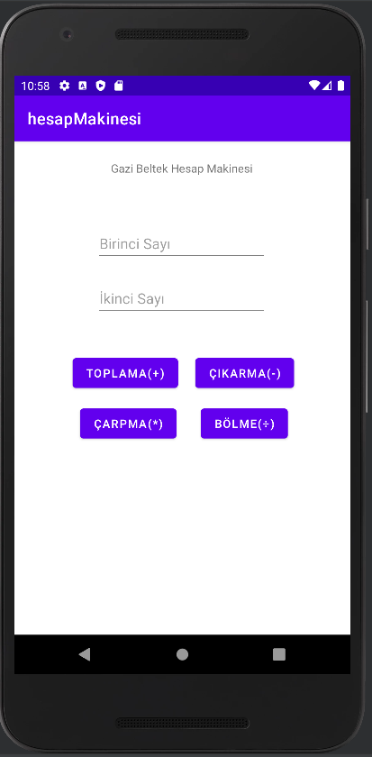
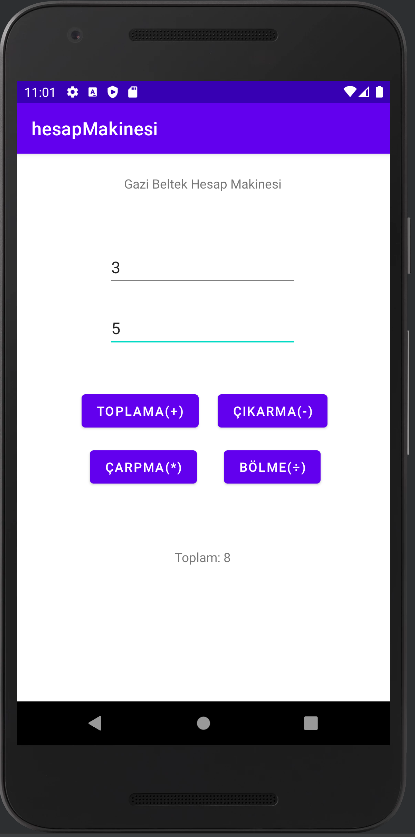
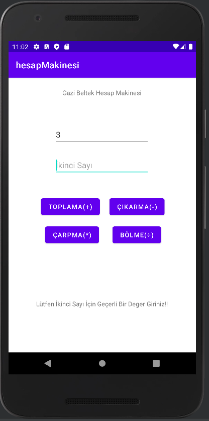

**Ders Konuları:**

1. *ders_05042022:*

+ Değişkenler, TextView ve Buttonların kullanımı
+ Proje: Butona basınca buton yazsının ve renginin değişmesi
+ Proje: Belirlenen üç değşkenin toplamı butona basılınca ekrana yazdırılır.

2. *ders_07042022:*

+ Button onClick özelliği ve fonksiyonların kullanımı
+ Proje: Butona basınca Gazi.edu.tr web sitesine gidilmesi

3. *ders_12042022-ders_14042022:*

+ Switch-case ve if-else kullanımı
+ Proje: Belirlenen 1-elektronik,2-giyim,3-yemek seçeneğinden birinin ekrana girilen değere göre seçilmesi ve seçilen kategorinin fiyatının ekrana yazılması. Butona basılmasından sonra ise ekrana ödendi yazdırılması.

4. *ders_16042022:*

+ For Döngüsü kullanımı
+ Proje: 1-10'a kadar olan sayıların toplamını ekrana yazdırma

5. *ders_19042022:*

+ While döngüsü kullanımı
+ Proje: Ekrandan girilen değerin faktöriyelini TextView ile yazdırma.

6. *ders_21042022:*

+ Toast kullanımı
+ Proje: Basit hesap makinesi

  

7. ders_26042022:

+ Intent kullanımı
+ ImageView kullanımı
+ Proje: Basit app giriş ve kullanıcı ekranı yapımı

8. ders_28042022:

+ ImageView ImageResource kaynağını değiştirerek aynı imageview'a farklı resim atama uygulaması